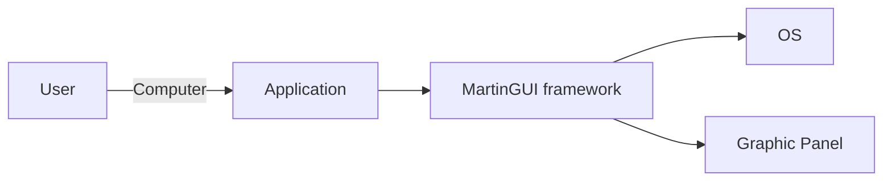
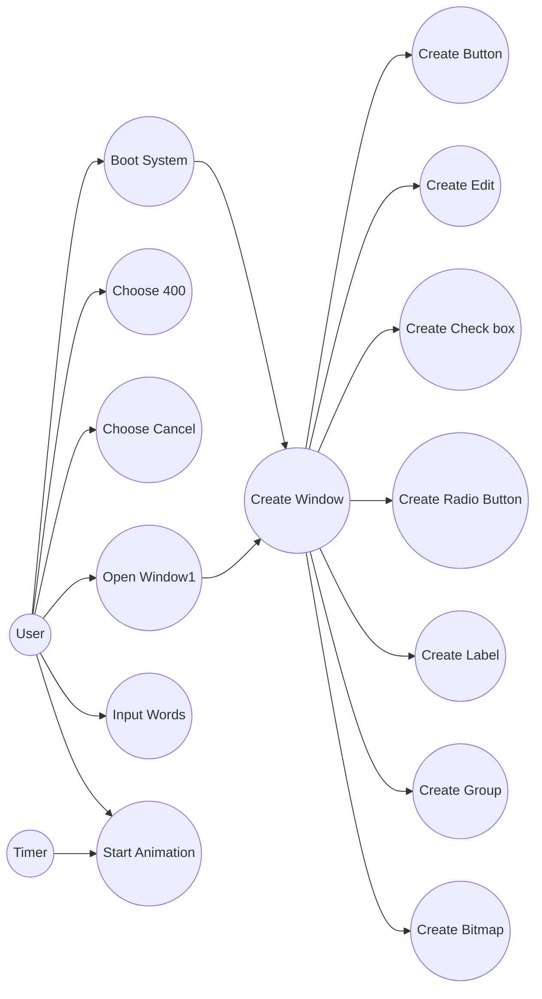
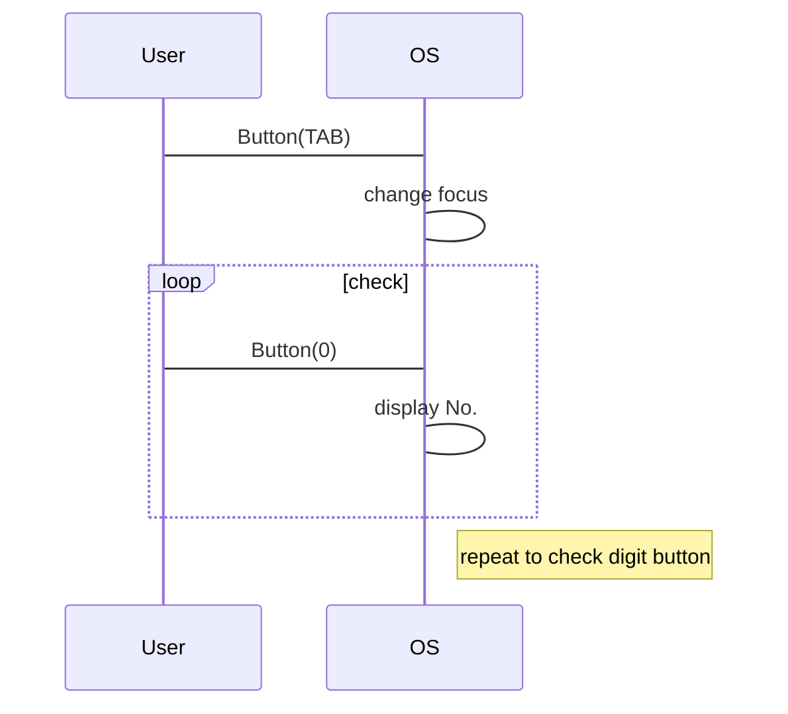
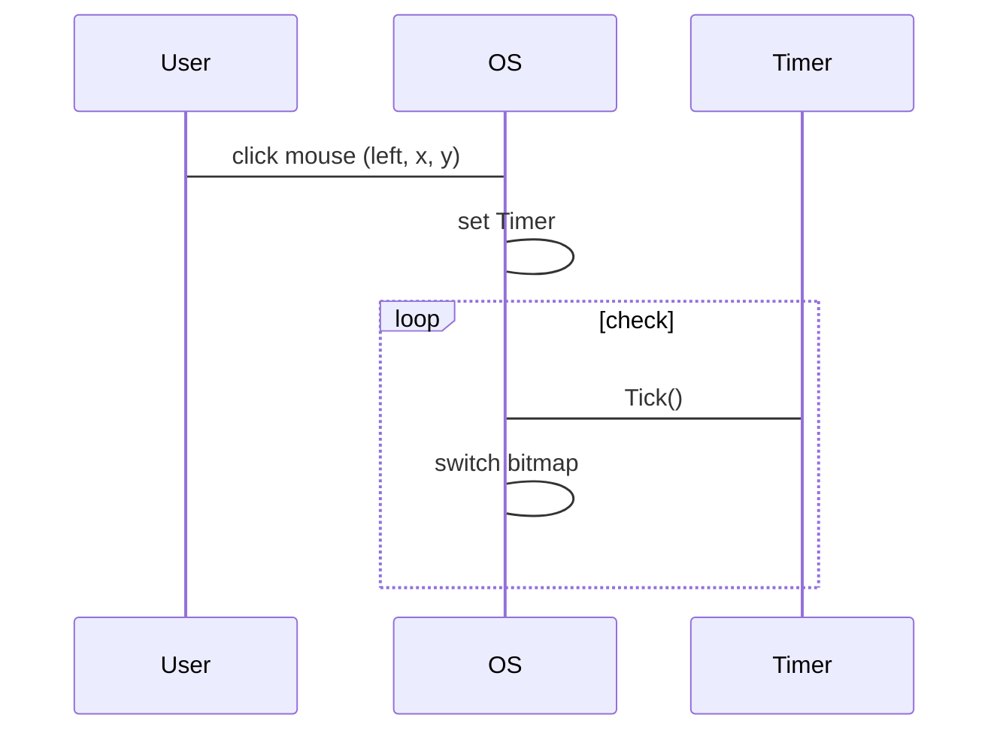

# MartinGUI

Based on the thought of [FishGUI](http://product.dangdang.com/1024374277.html), MartinGUI is using Python

Program based on MartinGUI: Code once, Run anywhere

## Steps

### 1. Requirement

define what we need to do

* Objective and Range

* Stakeholder

* Non-functional requirement

* Analyze functional requirement (Using Example analysis)

* Write Requirement Instruction 

| Instruction Name | MartinGUI Requirement Instruction | Privacy Level | Public |
|---------------------------|-----------------------------------------------------|--------------------|----------|
| Instruction Num | 0.1 | Editor | Martin Yang |
|Edite Date | 2018.03.03 | Reviewer | Martin Yang |
| Review Date | 2018.03.28 | Total Page | \** |

| Project Name | MartinGUI |
|---------------------|-----------------|
| Project Description | GUI framework, can provide Embed system a Graphic environment |
| User Describe | public |
| Functional Requirement | Can support User Interface described below:  * Create a Main Window when system boot * Create multiple Controls (such as buttons, labels, and edit boxes) * Provide animation function * User can input Numbers into edit box * User can use mouse to click buttons, then trigger some actions * Create a new Window which is over the main Window * User can operate Controls on new Window * When there's an animation runs on main Window, even though a new Window is over main Window, animation still plays * some specific button in keyboard could invoke specific function |
| Use Cases | ... |
| Restriction | Mouse can only control the active Window Windows back cannot be move to the front Windows below can get timer message to make animation active Window level is limited to 3 |
| Non-functional Requirement | Can be secondary development Can be used in deferent system which has Python installed The speed should be acceptable|

### 2.Analyze Use Case 

* Decide System Boundary 
* Decide participants
* Come up with all Use Cases
* Decide the level of each case
* Describe each case in words
* Draw a Object Flowchart

Figure 1. System Boundary

Figure 2. Use Case Analysis

Describe Use Case:
* Use Case name: Boot System
* User purpose: display main window and controls
	* Pre-requisite: None
	* Steps:
		* User boot system
		* Create a main window in screen
		* Create controls on main window

Figure 3. Sequence Diagram of Input Words

Figure 4. Create Animation

## Design method
High cohesion and low coupling ensuring these probabilities: 
1. readability 
2. reusability 
3. extensibility 
4. maintainability 

### Terms: 
Encapsulation(properties and methods), inheritance, and polymorphism(same method name, different method body) are three fundamental principles of OOLs
Generalization is the inverse of inheritance
Parent Class & Child Class <-> SuperClass & SubClass <-> BaseClass & DerivedClass

### Principles
开闭原则:一个模块对扩展应是开放的，对修改应是关闭的
完全替换原则:派生类应该能完全替换掉基类
依赖倒置原则:依赖于抽象，而不要依赖于具象
非循环依赖、原则:包和包之间不能有循环依赖、关系
只实现你真正需要的东西，不要去实现你认为需要的东西
不要重复自己:任何代码都只出现一次
保持简化的设计
为人写代码，而不是为机器写代码

### Steps of OO development
OO analysis
structure analysis
OO design
Programming (libraries & framework: system [.NET, MFC], middleware [EJB], industry, white-box, black-box)
Testing

### s/w life cycle model
waterfall model
Iterative model

## Design Patterns
### Purposes:
1. Adapt to the change of requirement
1. For interface programming, not for programming
1. Use aggregation (interface) first rather than inheritation (class)

### Classification: 
Based on Purpose:
* Creational: encapsulate the process of creating Object
* Structural: deal with the structure of Object
* Behavioural: iteractive between Objects

Based on Scope:
* Class (static): relation between baseClass and derivedClass 
* Object (dynamic): relation between Objects

